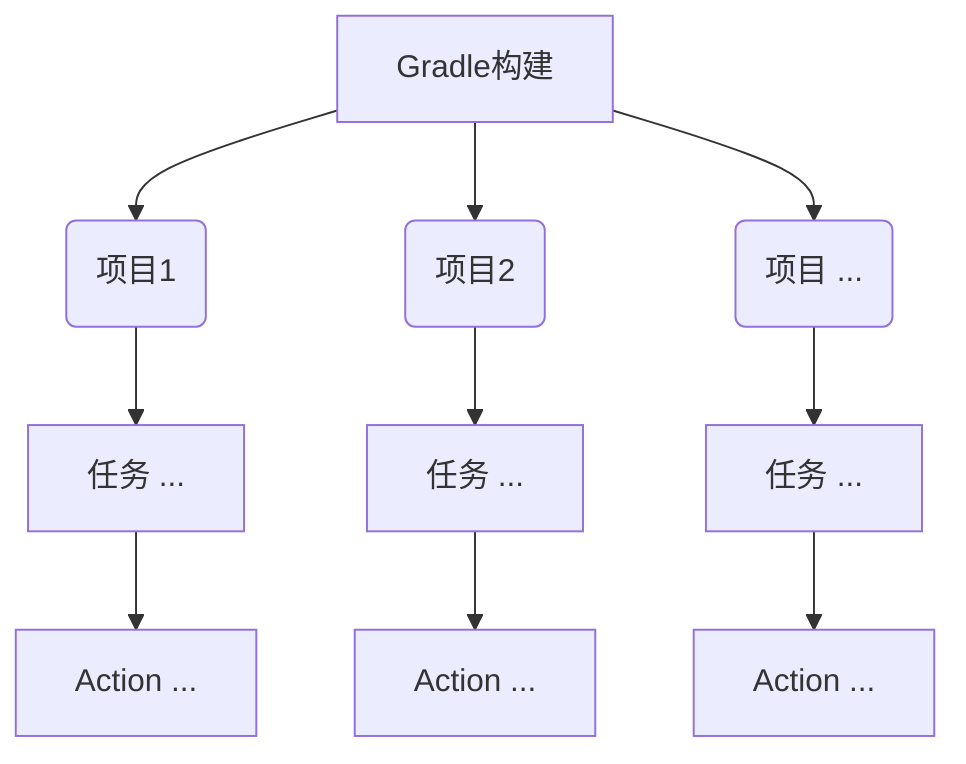

# 前言

Gradle是Android构建系统的重点，需要花费时间用心学习。学习资料主要是官方的[Gradle Docs](https://docs.gradle.org/current/userguide/userguide.html)，有个社区版的[中文翻译资料](https://dongchuan.gitbooks.io/gradle-user-guide-/)，英语不好的同学可以看看，但不全。

这章首先对Gradle做一个简单的介绍，然后讲如何使用官方文档和API，接着讲解Gradle的基本概念、Wrapper和学习中需要使用到的命令行指令、插件等。有些知识点如插件应该放在之后的章节讲解，但为了保持文章的完整性，我放在了这一章，学习的过程中可能不能完全理解，没有关系，在以后的章节中如果有涉及的话，会具体解释。

- - -
<br>


# Gradle简介

Gradle是一个注重灵活性和性能的开源构建自动化工具，使用Groovy或Kotlin DSL来编写构建脚本。

> 虽然支持Kotlin，但还是建议学习Groovy。因为：一，目前官方示例里有许多还没有kotlin方式；二，目前大多数项目的Gradle脚本都是用Groovy编写的。

Gradle特点如下：

1. 高度可定制。Gradle使用了可定制和可扩展的设计思想，如使用插件。
2. 快速。Gradle通过重用先前执行的输出，仅处理已更改的输入以及并行执行任务来快速完成任务。
3. 强大。Gradle是Android的官方构建工具，并支持许多主流的编程语言和技术。


**图形界面和命令行** Gradle支持IDE或命令行两种方式来构建工程。支持主流的IDE，如Android Studio, Eclipse, IntelliJ IDEA, Visual Studio 2017, 和XCode等。
>提示：命令行方式构建是必须掌握的，因为命令行方式包含所有的功能，而图形界面方式却未必。在调试时，命令行方式尤其重要。

**典型的工程目录** 一个典型Gradle项目一般会包括两个脚本文件（`settings.gradle`和`build.gradle`）和Wrapper文件（gradle文件目录和gradlew、gradlew.bat可执行文件）。如下所示
```groovy
├── settings.gradle 
├── build.gradle
├── gradle
│   └── wrapper
│       ├── gradle-wrapper.jar  
│       └── gradle-wrapper.properties  
├── gradlew  
└── gradlew.bat
```
其中`settings.gradle`和`build.gradle`是项目构建时所需的脚本，Gradle会据此创建相应的Java实例。Wrapper文件用于管理`gradle`版本，一个终端上不同的项目可以使用不同配置和版本的Gradle，具体项目中使用`./gradlew`或`gradlew.bat`来替代`gradle`命令。

- - -
<br>


# Gradle Docs的使用

[Gradle Docs](https://docs.gradle.org/current/userguide/userguide.html)资料中，最重要的是User Manual（用户手册）和API文档（DSL Reference和Javadoc），其余的可以不用看。

**Gradle User Manual** User Manual中最关键的一部分当属“Build Configuration Scripts”（官网经常换名字，可能已经不叫这个标题了）。这一部分内容相当多，内容也比较杂。可以先看[Build Lifecycle](https://docs.gradle.org/current/userguide/build_lifecycle.html)和[Configuring Multi-Project Build](https://docs.gradle.org/current/userguide/multi_project_builds.html)这两节，看懂这两节，就可以对Gradle构建的流程有一个清晰的了解了，之后再看其他章节就非常容易了。

**API文档** API文档包括[Gradle DSL Reference（Gradle特定语言指南）](https://docs.gradle.org/current/dsl/) 和 [Javadoc（Java文档）](https://docs.gradle.org/current/javadoc/)。Reference包含主要的接口和类，并做了描述和分类以利于学习，Javadoc包含所有的API，主要用于检索。就内容的覆盖面而言，Javadoc完全包含Reference。学习时可以看Reference，使用中具体查找Gradle的某个API文档时，用Javadoc。

-- -- --

<br>


# 基础概念

使用Gradle构建项目时，会经常涉及到几个重要的概念：脚本(Script)、项目(Project)和任务(Task)。这几个概念出现的顺序如下：
1. 开发者编写脚本，如`settings.gradle`和`build.gradle`；
2. 构建项目时，Gradle会根据构建脚本创建对应的Java实例，如`settings.gradle`对应[Setting](https://docs.gradle.org/current/dsl/org.gradle.api.initialization.Settings.html)，`build.gradle`对应[Project](https://docs.gradle.org/current/dsl/org.gradle.api.Project.html)，其中`Project`包含构建需要的任务集。然后，Gradle根据这些实例依次执行初始化、项目配置和任务执行等来构建项目。


## [脚本(Script)](https://docs.gradle.org/current/dsl/org.gradle.api.Script.html)

利用Gradle构建项目时，与开发者直接交互的就是脚本了。[Gradle脚本有以下特点](https://docs.gradle.org/current/dsl/)：
1. 每个脚本都有一个对应的Java实例，称为代理对象，在脚本中可以直接使用代理对象的属性和方法。
2. Gradle脚本实现了[`Script`](https://docs.gradle.org/current/dsl/org.gradle.api.Script.html)接口。此接口定义了许多属性和方法，可以在脚本中直接使用。
3. Gradle脚本由零或多个语句和脚本块组成（statements and script blocks）。 语句包括方法调用、属性赋值和局部变量定义等。 脚本块是一种方法调用，它以闭包作为方法的参数，而闭包用来配置代理对象。

## [项目(Project)](https://docs.gradle.org/current/dsl/org.gradle.api.Project.html)

项目是Gradle的最基本的概念之一。
Gradle通过`build.gradle`脚本生成实现了`Project`接口的项目实例，每个Gradle构建都由一个或多个项目组成。`Project`接口是脚本文件与Gradle交互的主要API，可以通过`Project`实例访问Gradle的所有功能。

## [任务(Task)](https://docs.gradle.org/current/dsl/org.gradle.api.Task.html)

项目由一个或多个任务组成。 每个任务执行一些基本工作，例如编译类、运行单元测试或压缩WAR文件等。
任务由一系列Action对象组成。 执行任务时，通过调用`Action.execute（T）`依次执行每个`Action`。 可以通过调用`Task.doFirst（org.gradle.api.Action）`或`Task.doLast（org.gradle.api.Action）`向任务添加`Action`。


**概念之间的关系** Gradle中项目和任务、Action的关系如下：



**浏览官方文档** 以上概念详细说明和使用，请见官方手册和指南：

1. 脚本。[Writing Build Scripts](https://docs.gradle.org/current/userguide/writing_build_scripts.html)、[Script Reference](https://docs.gradle.org/current/dsl/org.gradle.api.Script.html)
2. 项目。[Project Reference](https://docs.gradle.org/current/dsl/org.gradle.api.Project.html)
3. 任务。[Build Script Basics](https://docs.gradle.org/current/userguide/tutorial_using_tasks.html)、[Authoring Tasks](https://docs.gradle.org/current/userguide/more_about_tasks.html)、[Writing Custom Task Classes](https://docs.gradle.org/current/userguide/custom_tasks.html)、[Task Reference](https://docs.gradle.org/current/dsl/org.gradle.api.Task.html)

以上文档可以不用深读，但需要浏览一遍，知道大概。

- - -
<br>


# Gradle Wrapper
前言中已经提到了Wrapper，即一种管理当前项目的Gradle版本的工具。多人协作时，每个人安装的Gradle环境可能不一致（也没有必要一致），需要使用Wrapper管理项目的版本。官方强烈推荐使用Wrapper管理具体的项目，并以`./gradlew`(macOS)代替`gradle`执行命令。
Wrapper目录中有一个`gradle-wrapper.properties`文件，配置Gradle的版本号、本地存储地址等。

**引入Wrapper** 使用命令行添加Wrapper有两种方式：
1. 使用`gradle init`创建新项目，则会初始化一个带有Wrapper的Gradle项目。
2. 使用`gradle wrapper`在旧的项目中添加Wrapper。
> `wrapper`是Gradle的内建任务

一般的IDE创建项目时都会自动生产Wrapper文件，如Android Studio。

**使用Wrapper执行任务** 用Wrapper脚本替换掉`gradle`来执行任务即可。以macOS平台为例，在项目根目录下执行`./gradlew [task name] `即可，如列出当前项目的所有任务，项目根目录下执行：
```shell
$ ./gradlew tasks
```

**更新Wrapper** 有两种方式更新Wrapper
1. 命令行方法。`.gradlew wrapper --gradle-version [要更新的版本号]`。
2. 修改`gradle/wrapper/gradle-wrapper.properties`中的`distributionUrl`属性。

关于Gradle Wrapper的详细说明请见官方手册[The Gradle Wrapper](https://docs.gradle.org/current/userguide/gradle_wrapper.html)

- - -
<br>


# 命令行
**指令形式** Gradle命令行指令由三部分组成: 可执行文件`gradle`或`./gradlew`、一个或多个任务名、零或多个选项名，如下所示：。
```shell
$ gradle [taskName...] [--option-name...]
```
指令的详细说明请见官方手册[Command-Line Interface](https://docs.gradle.org/current/userguide/command_line_interface.html)，这里我只介绍学习或调试中常用的指令。部分常见命令行选项说明如下：

**固有任务类**
- `gradle build`。生成所有的输出，并执行所有的检查。
- `gradle clean`。删除build文件目录。
- `gradle projects`。查看项目结构。
- `gradle tasks`。查看任务列表。查看某个任务详细信息，可用`gradle help --task someTask`
- `gradle dependencies`。查看依赖列表。

**调试类**
- `-?`, `-h`, `--help`。查看帮助信息。
- `-v`,` --version`。查看版本信息。
- `-s`,` --stacktrace`。执行任务时，打印栈信息。如`gradle build -s`

**日志类**

- `-q`, `--quiet`。只打印errors类信息。
- `-i`, `--info`。打印详细的信息。

其中在学习的过程中，经常会用到
```
$ gradle [taskName...] -i
```
这会打印比较详细的构建信息，用于帮助我们理解Gradle构建流程、项目配置和依赖、任务依赖等。

- - -
<br>


# 环境配置
配置构建环境，主要配置Gradle构建参数和对应的JVM参数，如代理策略等。其目的是为了多人协作时，保持在一致的环境下进行项目开发。

配置环境有几种途径，优先级从高往低，列出如下：
1. 命令行。
2. `GRADLE_USER_HOME`目录中的`gradle.properties`文件。
3. 项目根目录中的`gradle.properties`文件。
4. 环境变量。运行Gradle环境的变量，如JAVA_HOME等。

具体参数的配置请见官方手册[Build Environment](https://docs.gradle.org/current/userguide/build_environment.html)

- - -
<br>


# 依赖管理

现在的项目基本上都需要使用第三方库，一般称其为依赖，这样说并不准确，[官方的定义]((https://docs.gradle.org/current/userguide/dependency_management_terminology.html#sub:terminology_module))是:

> A dependency is a pointer to another piece of software required to build, test or run a module
>
> 依赖是指向软件模块的指针，而非模块本身

依赖管理是一种以自动方式声明、解析和使用项目所需的依赖的技术。


**依赖管理流程** 

1. 声明。在构建脚本中声明依赖和对应的仓库。 
2. 解析。项目构建时，Gradle会定位依赖的本地路径或远程服务器路径并下载依赖（有必须要的话）。 
3. 缓存。依赖解析后，Gradle会将从远程服务下载的依赖缓存到本地，避免下次构建时重复下载。 


**依赖的类型**

- 模块依赖（Module dependencies）。指向一个库中的模块，这是最常见的依赖类型。
- 文件依赖。指向无需仓库的一系列文件。
- 项目依赖。指向多项目工程主项目需要用到的其他项目。
- 特定分发的依赖。如API依赖、TestKit依赖和本地Groovy依赖等。 


**常见的仓库**

- 文件系统仓库。通过查找文件目录以解析依赖。
- Maven Central 仓库。一般默认的Maven仓库。
- JCenter Maven 仓库。Android默认的Maven仓库。
- Google Maven 仓库。Google的支持库所在的Maven仓库。
- 本地 Maven仓库。就是你开发项目所用的主机中的仓库。
- 自定义Maven仓库。一些公司，如阿里，喜欢把阿里云OSS服务SDK等存储在自己搭建的Maven仓库中。
- Ivy仓库。不常用。

> Maven仓库是用[Apache Maven](javascript:void%200)工具搭建的存储不同类型资源的本地或远程资源服务。Maven Central仓库、JCenter Maven仓库和Google Maven仓库都是Maven仓库，区别在于存储的服务器和管理的机构不一样。 

-- -- --

<br>


# 插件(Plugin)

**插件简介** Gradle的一个非常大的特点就是灵活或者说可扩展性，它本身没有提供多少构建具体任务的逻辑，构建各类具体的项目都是通过增加插件实现的。插件可以添加新任务（例如JavaCompile），新的域对象（例如SourceSet），新的规定（例如Java源位于src/main/java）以及继承其他插件而获得的功能。
Gradle本身提供了一些基础的插件，只需要配置id即可使用，如` Java Plugin`。

**二进制插件及配置** 插件分为两种，本地脚本插件和远程发布的二进制插件，一般我们常用的是后者。如Android项目中我们用到的Android插件，就是一种远程二进制插件。
Android项目添加插件示例：
在根目录`build.gradle`中添加仓库和插件路径

```groovy
buildscript {
    repositories {
        google()
        jcenter()
    }
    dependencies {
        classpath 'com.android.tools.build:gradle:3.1.4'
    }
}
```
在app目录`build.gradle`中应用插件
```groovy
apply plugin: 'com.android.application'
```

**插件的使用** Gradle使用插件里的构建逻辑分为两步

1. 解析插件。即获取插件的jar包。插件被解析后，就可以在脚本文件中直接使用它的API，如Android项目脚本文件中的配置`android`、方法`compileSdkVersion`等。本地脚本插件和Gradle固有插件会自动解析。
2. 应用插件。即执行插件的`Plugin.apply(T)`方法，这是插件的核心方法。在这个方法中，可以为当前项目添加一些新的任务。

关于插件更详细的说明请见官方手册:
1. [Using Gradle Plugins](https://docs.gradle.org/current/userguide/plugins.html#sec:using_plugins)
2. [Standard Gradle plugins](https://docs.gradle.org/current/userguide/standard_plugins.html)
3. [Core Plugin](https://docs.gradle.org/current/userguide/plugin_reference.html)
4. [Writing Custom Plugins](https://docs.gradle.org/current/userguide/custom_plugins.html)

如何你想查看Gradle源码，看看插件是如何实现的，链接如下：
1. [Github上的Gradle源码](https://github.com/gradle/gradle)
2. [Android插件源码-AOSP](https://source.android.com/setup/build/downloading)
3. [Andorid插件源码-repe.spring.io](http://repo.spring.io/libs-milestone/com/android/tools/build/gradle/)
4. [Android源码-android.google.source](https://android.googlesource.com/platform/tools/build/+/e49dcf3e1edbe40d945a24fee85c6422eb6221b9/)

-- -- --

<br>


# 示例-单项目构建

官方示例 [Creating New Gradle Builds](https://guides.gradle.org/creating-new-gradle-builds/?_ga=2.262531468.1022039991.1532854446-1803358189.1525999794)
主要练习：初始化项目、执行任务、移动文件、添加Plugin等。

> 提示：示例中使用了`./gradlew`来执行命令，如果因为下载失败导致该命令不可用，使用`gradle`命令即可。

- - -

<br>


# 示例-多项目构建

官方示例 [Creating Multi-project Builds](https://guides.gradle.org/creating-multi-project-builds/?_ga=2.39430567.560526946.1533349009-1803358189.1525999794)

> 提示：示例中需要下载依赖，国内网络直接访问可能导致下载失败，需要设置国外代理服务。我的代理服务走的通道是`shadowsocks`，有的资源使用`shadowsocks`协议是访问不了的，需要使用`http`或`https`协议才行，可以使用`privoxy`切换`shadowsocks`协议为`http`和`https`协议（实际上是在本地`shadowsocks`端口上再加了一层`privoxy`代理）。
> `shadowsocks`代理设置请参考[Github shadowsocks](https://github.com/shadowsocks/shadowsocks/blob/master/README.md)
> `privoxy`代理设置请参考 [Privoxy 官网](https://www.privoxy.org/)、[使用Privoxy桥接Http代理到SOCKS5代理](http://lazybios.com/2016/11/transter-socks5-to-http-by-privoxy/)、[Privoxy 教程](https://blog.zfanw.com/privoxy-tutorial/)
> Gradle项目代理设置如下：在电脑中设置好`http`协议代理后，在当前项目根目录下创建`gradle.properties`文件（如果有就不用创建），编辑文件如下:
>
> ```gradle
> systemProp.http.proxyHost=127.0.0.1
> systemProp.http.nonProxyHosts=192.168.*, <localhost>
> systemProp.http.proxyPort=8118
> systemProp.https.proxyHost=127.0.0.1
> systemProp.https.nonProxyHosts=192.168.*, <localhost>
> systemProp.https.proxyPort=8118
> ```
>
> 其中`8118`是`privoxy`的端口号
> Gradle代理设置详细说明请参考官方文档[Accessing the web via a proxy](https://docs.gradle.org/4.0/userguide/build_environment.html#N10D07)（虽然也不够详细:p）

-- -- --

<br>


# 示例-Android项目根目录 `build.gradle`语法分析

利用`Android Studio`创建一个项目，根目录中`build.gradle`文件如下

```groovy
buildscript {
    ext.kotlin_version = '1.2.50'
    repositories {
        google()
        jcenter()
    }
    dependencies {
        classpath 'com.android.tools.build:gradle:3.1.4'
        classpath "org.jetbrains.kotlin:kotlin-gradle-plugin:$kotlin_version"

        // NOTE: Do not place your application dependencies here; they belong
        // in the individual module build.gradle files
    }
}

allprojects {
    repositories {
        google()
        jcenter()
    }
}

task clean(type: Delete) {
    delete rootProject.buildDir
}
```

直接使用API文档来分析上面的代码：

* `Project`和方法。`build.gradle`脚本的代理对象是`Project`实例，`buildscript`、`allprojects`和`task`是`Project`中的三个方法（实际上，`task`在这里是关键字，不是方法，但`Project`中有方法与之对应）。

* `buildscript`。在`Android Studio`中(`Mac`平台 `Command+鼠标左键`)或者在文档中查看API详情，如下
  
  这个方法的作用是配置项目构建脚本的`classpath`，参数是一个闭包，闭包的代理对象是`ScriptHandler`，即如果`buildscript`代码块中的属性和方法，如果不能在`Project`中找到，就去`ScriptHandler`中去找。
  再来分析下`buildscript`代码块里的内容。示例代码中，`repositories`和`dependencies`都是`ScriptHandler`的方法，可以直接在`Android Studio`中点击查看其API。但`ext`是什么，是谁的属性？`owner`（`Project`）的，还是`delegate`（`ScriptHandler`）的？由于不能在`Studio`里直接查看，我们先看看`Project`的API
  
  全局搜索`ext`或`setExt`、`getExt`，都没有结果。再看看其继承的接口，发现[ExtensionAware](https://docs.gradle.org/current/javadoc/org/gradle/api/plugins/ExtensionAware.html)中可以搜索到，API文档说

> ```groovy
>  // All extension aware objects have a special “ext” extension of type >ExtraPropertiesExtension
>  assert project.hasProperty("myProperty") == false
>  project.ext.myProperty = "myValue"
>  // Properties added to the “ext” extension are promoted to the owning >object
>  assert project.myProperty == "myValue"
> ```
>
> 继承了`ExtensionAware`的对象都有一个特殊的`ext`扩展类型，可以直接添加属性`project.ext.myProperty = "myValue"`，之后使用属性`myProperty`时可以不用写`ext`，如`project.myProperty`。
> 因此示例代码中的`ext`是`owner`（`Project`）的属性。

* `allprojects`。分析方法同上，略。

* `task`。`Project`中有四个`task`方法

> `Task task(String name)`
> `Task task(String name, Closure configureClosure)`
> `Task task(Map<String, ?> args, String name)`
> `Task task(Map<String, ?> args, String name, Closure configureClosure)`

`Studio`中链接的是`Task task(String name)`，但后面的`clean(type: Delete) {
​    delete rootProject.buildDir
}`是什么呢？开始以为是方法，实际上并不是，一是在`Project`中没有`clean`方法，二是[Groovy语法中不允许嵌套的方法省略括号](http://www.groovy-lang.org/semantics.html#_optional_parentheses)。

> Parentheses are required for method calls without parameters or ambiguous method calls:
>
> ```
> println(Math.max(5, 10))
> ```
>
> 不是方法，但看起来又不是参数。查看`Task`API，有定义task的示例
> You can also use the task keyword in your build file:
>
> ```
> task myTask
> task myTask { configure closure }
> task myTask(type: SomeType)
> task myTask(type: SomeType) { configure closure }
> ```
>
> 也就是说`task`可以是一个关键字！去看Gradle官方文档[Defining tasks](https://docs.gradle.org/current/userguide/more_about_tasks.html#sec:defining_tasks)
> There are a few variations on this style, which you may need to use in certain situations. For example, the keyword style does not work in expressions.

有很多方式定义task，有关键字格式：

```
task copy(type: Copy) {
    from(file('srcDir'))
    into(buildDir)
}
```

我们的示例就是这种格式的。
也有方法格式的：

```
task('copy', type: Copy) {
    from(file('srcDir'))
    into(buildDir)
}
```

这对应`Project`的方法`Task task(Map<String, ?> args, String name, Closure configureClosure)`。Groovy方法中的参数似乎是可以改变顺序的，有人写的[博客](https://blog.csdn.net/cckevincyh/article/details/75094293)中提到了这件事，但我没有找到相关的官方文档。
终于分析完了，初学者学习这些估计要抓狂，:p。

最后，把示例代码中省略的括号和`owner`、`delegate`补全，以提高可读性，如下

```groovy
buildscript({
    owner.ext.kotlin_version = '1.2.50'
    delegate.repositories({
        delegate.google()
        delegate.jcenter()
    })
    dependencies({
        delegate.add('classpath', 'com.android.tools.build:gradle:3.1.4')
        delegate.add('classpath', "org.jetbrains.kotlin:kotlin-gradle-plugin:${owner.kotlin_version}")
        // NOTE: Do not place your application dependencies here; they belong
        // in the individual module build.gradle files
    })
})

allprojects({
    delegate.repositories({
        delegate.google()
        delegate.jcenter()
    })
})

task clean(type: Delete) {
    delete rootProject.buildDir
}
```

> 注意: 其中的`classpath`，我暂时并没有理解清楚它是如何工作的，它不是方法，只能理解它是一个可以添加的配置属性。
>
> ```
> Dependency add(String configurationName, Object >dependencyNotation);
> ```

-- -- --

<br>


# 参考

1. [Gradle官网](https://gradle.org/)
2. [Gradle User Guide 中文版(非官方)](https://dongchuan.gitbooks.io/gradle-user-guide-/)
3. [Groovy官网](http://www.groovy-lang.org/learn.html)