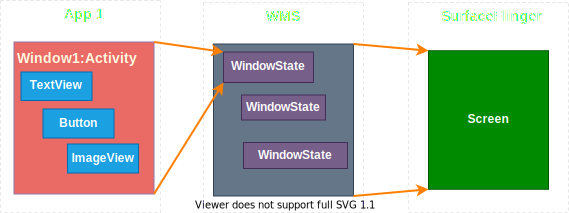

# 说明

当我们调用`TextView.setTextColor()`之后，UI就会更新，这一过程是怎样的？本文通过较完整的视图绘制流程分析Android的图形系统。

代码基于Android 10。

大纲：绘制概览：流程、静态关系图；如何测量、如何布局、如何绘制、底层如何绘制、合成、显示

# 概述

对于Android图形系统，可以这样理解：App中我们见到状态栏、Activity界面、弹窗等都是一个个窗口，对应App端的Window和服务端的WindowState；每个窗口包含多个控件，对应View和ViewGroup；每个窗口独占单独的画布，对应Surface（持有Canvas）；多个画布内容通过SurfaceFlinger合成一帧画面，最后通过显示设备输出。

> 说得比较粗糙，实际情况比这复杂得多，待以后优化 **TODO**

简单的对应关系如图：



Window和WindowState都间接持有Surface的引用，WindowState持有与SurfaceFlinger的连接Session。可通俗理解为，多个View控件构成一个Surface内容，多个Surface内容通过SurfaceFlinger合成为一帧最终输出的图像。

下面以具体代码来分析Android图形系统，分析`TextView.setTextColor()`调用链流程，可分为两个阶段：

- 准备阶段：计算脏区位置和宽高（Dirty Rect，就是待更新区域）、测量、布局，之后调用`ViewRootImpl.performDraw()`尝试硬件绘制，不能或不成功则进行软件绘制。

- 绘制阶段：区分软件绘制和硬件绘制，绘制数据有所差别，但最终都是将绘制数据填充到GraphicBuffer，通知SurfaceFlinger进行合成，SurfaceFlinger利用硬件(OpenGL 和 HardWare Composer)将 GraphicBuffer 数据合成并交给Display Buffer去显示。

  > 这个阶段可细分为绘制、合成和显示

绘制阶段流程如下：


> 这幅图参考[Android-Surface原理解析](https://ljd1996.github.io/2020/11/09/Android-Surface%E5%8E%9F%E7%90%86%E8%A7%A3%E6%9E%90/)，图例比较清晰全面，我直接拿过来并重新绘制了全图。

# 准备阶段

准备阶段的工作：

- 计算脏区在屏幕中位置和宽高。计算时会调用`ViewGroup.invalidateChild()`遍历当前View的所有的`ViewParent`，直到`ViewRootImpl`为止。
- 测量所有View的宽高。在`ViewRootImpl.performTraversals()`中会依次调用`performMeasure()`、`performLayout()`、`performDraw()`三个主要方法。`performMeasure()`即测量。测量过程中，系统将View的LayoutParams根据父容器所施加的规则转换成对应的MeasureSpec，然后在onMeasure方法中根据这个MeasureSpec来确定View的测量宽高。**TODO**
- 布局。在`ViewRootImpl.performTraversals()`中`performLayout()`执行布局。**TODO**
- 在`ViewRootImpl.performDraw()`中首先尝试硬件绘制，不能或不成功则软件绘制。软件绘制会调用`ViewRootImpl.drawSoftware`，其中会通过`Surface`生成`Canvas`以传递给视图树使用。

准备阶段时序图如下：


> 略繁琐，逻辑不够清晰，待以后更新 **TODO**

**关键代码**

`ViewGroup.invalidateChild()`: 遍历所有ViewParent以计算脏区

```java
// 这个child是示例的TextView
public final void invalidateChild(View child, final Rect dirty) {
    final AttachInfo attachInfo = mAttachInfo;
    ViewParent parent = this;
    final int[] location = attachInfo.mInvalidateChildLocation;
    location[CHILD_LEFT_INDEX] = child.mLeft;
    location[CHILD_TOP_INDEX] = child.mTop;
    do {
        // 遍历所有的ViewParent. 首先进入ViewGroup，最后进入ViewRootImpl
        parent = parent.invalidateChildInParent(location, dirty);
    } while (parent != null);
}
```

`ViewRpotImpl.scheduleTraversals()`: 发起绘制请求

```java
void scheduleTraversals() {
    // 阻塞同步消息？
    mTraversalBarrier = mHandler.getLooper().getQueue().postSyncBarrier();
    // 通过Handler发起请求
    mChoreographer.postCallback(Choreographer.CALLBACK_TRAVERSAL, mTraversalRunnable, null);
}
```

`ViewRootImpl.performTraversals()`: 执行绘制请求

```java
private void performTraversals() {
    // Ask host how big it wants to be
    performMeasure(childWidthMeasureSpec, childHeightMeasureSpec);
    performLayout(lp, mWidth, mHeight);
    performDraw();
}
```

# 绘制阶段

## Surface的创建

绘制流程中涉及到Surface，有必要先描述Surface相关对象的创建。相关对象有：SurfaceSession、SurfaceControl和Surface，这三个对象的Java层实例都持有其Native层的指针，实际绘制工作最终都由Native层完成。

### **SurfaceSession**

代表Surface与SurfaceFlinger 的连接，通过该连接可以创建多个Surface实例；持有客户端SurfaceComposerClient的指针，连接的实现由其实现，可用于创建SurfaceControl。

SurfaceSession对象是在Window添加流程中创建的，在`WMS.addWindow() `方法中创建 WindowState，它会调用`WindowState.attach()`方法，该方法内调用`Session.windowAddedLocked()`，在这里创建Java端的SurfaceSession对象。SurfaceSession构造方法会通过JNI创建一个 Native端的SurfaceComposerClient 对象，后者又创建了一个 实现了ISurfaceComposerClient接口的Client 对象，通过此对象与SurfaceFlinge通信。

创建的时序图：


相关代码：由于涉及C++代码，稍微贴下较详细的代码

```c++
// Session.java
void windowAddedLocked(String packageName) {
    mSurfaceSession = new SurfaceSession();
}

// SurfaceSession.java
private long mNativeClient; // SurfaceComposerClient*
// 创建与Surface Flinger的连接
public SurfaceSession() {
    mNativeClient = nativeCreate();
}

// frameworks/base/core/jni/android_view_SurfaceSession.cpp
static jlong nativeCreate(JNIEnv* env, jclass clazz) {
    SurfaceComposerClient* client = new SurfaceComposerClient();
    client->incStrong((void*)nativeCreate);
    return reinterpret_cast<jlong>(client);
}

// 调用incStrong函数时，如果SurfaceComposerClient是第一次被引用则会调用onFirstRef()函数
// frameworks/native/libs/gui/SurfaceComposerClient.cpp
void SurfaceComposerClient::onFirstRef() {
    // 从服务端(surface flinger)获取服务
    sp<ISurfaceComposer> sf(ComposerService::getComposerService());
    // 通过服务创建连接
    sp<ISurfaceComposerClient> conn = sf->createConnection();
    mClient = conn;
}

// frameworks/native/services/surfaceflinger/SurfaceFlinger.cpp
sp<ISurfaceComposerClient> SurfaceFlinger::createConnection() {
    // initClient方法只是调用initCheck检查了一下
    return initClient(new Client(this)); 
}
```


### **SurfaceControl**

用于Surface的创建等管理。

客户端ViewRootImpl中持有一个SurfaceControl，但开始是无内容无效的。`ViewRootImpl.performTraversals()`中会调用`ViewRootImpl.relayoutWindow()`方法，之后会通过Session将此SurfaceControl传给WMS，WMS创建WindowSurfaceController对象，该对象构造器内部创建并持有新的SurfaceControl实例，它通过`nativeCreate()`方法创建底层实例即客户端的SurfaceControl以及SurfaceFlinger端的Layer，并持有底层SurfaceControl的指针。

> 此处旧的SurfaceControl与新创建的SurfaceControl是何关系？ **TODO**

创建的时序图如下：


相关代码：

```java
// ViewRootImpl.java
private void performTraversals() {
    // 需要进行布局操作时
    relayoutWindow(params, viewVisibility, insetsPending)
    // measure, layout, draw
}

private int createSurfaceControl(SurfaceControl outSurfaceControl...) {
    WindowSurfaceController surfaceController;
    surfaceController = winAnimator.createSurfaceLocked(...);
    if (surfaceController != null) {
        surfaceController.getSurfaceControl(outSurfaceControl);
    }
}
```

### Surface


