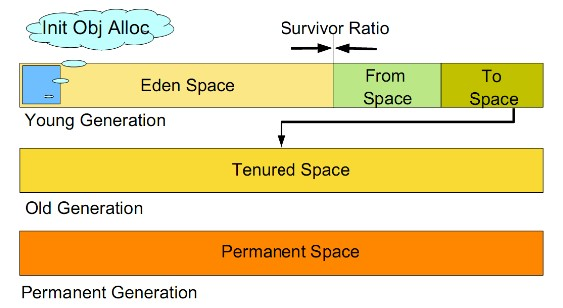

# 简介

垃圾回收（Garbage Collection）是Java虚拟机垃圾回收器提供的一种用于在空闲时间不定时回收无任何对象引用的对象所占据内存空间的一种机制。

> 注意：垃圾回收器回收的是无用对象占据的内存空间。

<!--more-->

# 判断对象可被回收的方法

**引用计数算法**。给对象中添加一个引用计数器，每当有一个地方引用它时，计数器就加1；当引用失效时，计数器值就减1；任何时刻计数器都为0的对象就是不可能再被使用的。但是Java语言没有选用引用计数法来管理内存，因为引用计数法不能很好的解决循环引用的问题。

**根搜索算法**。在主流的商用语言中，都是使用根搜索算法来判定对象是否存活的。GC Root Tracing 算法思路就是通过一系列的名为"GC  Roots"的对象作为起始点，从这些节点开始向下搜索，搜索所走过的路径称为引用链（Reference Chain），当一个对象到GC Roots没有任何引用链相连，即从GC Roots到这个对象不可达，则证明此对象是不可用的。

可作为GC Roots的对象：

- 方法区中的常量引用的对象
- 方法区中的类静态属性引用的对象
- 虚拟机栈（栈帧中的本地变量表）中的引用的对象
- 本地方法栈中JNI（Native方法）的引用对象

# GC流程

HotSpot JVM 将堆分成了 二个大区**Young** 和**Old**，而Young 区又分为 Eden、Servivor1、Servivor2。

所有新new出来的对象都会最先出现在Eden区中，当Eden区内存满了之后，就会触发一次Minor GC，这种收集通常比较快，因为新生代的大部分对象都是需要回收的，那些暂时无法回收的就会被移动到老年代。

> minor garbage collections都是**Stop the World**事件

升到老年代的对象大于老年代剩余空间时full gc，或者小于时被HandlePromotionFailure参数强制full gc。

# GC算法有哪些？

### 1. 标记-清除算法

该算法分为“标记”和“清除”阶段：首先标记出所有需要回收的对象，在标记完成后统一回收所有被标记的对象。它是最基础的收集算法，后续的算法都是对其不足进行改进得到。这种垃圾收集算法会带来两个明显的问题：

1. **效率问题**
2. **空间问题（标记清除后会产生大量不连续的碎片）**

### 2. 复制算法

为了解决效率问题，“复制”收集算法出现了。它可以将内存分为大小相同的两块，每次使用其中的一块。当这一块的内存使用完后，就将还存活的对象复制到另一块去，然后再把使用的空间一次清理掉。这样就使每次的内存回收都是对内存区间的一半进行回收。

### 3. 标记-整理算法

根据老年代的特点提出的一种标记算法，标记过程仍然与“标记-清除”算法一样，但后续步骤不是直接对可回收对象回收，而是让所有存活的对象向一端移动，然后直接清理掉端边界以外的内存。

### 4. 分代收集算法

分代收集算法是基于这样一个事实：不同的对象的生命周期(存活情况)是不一样的，而不同生命周期的对象位于堆中不同的区域，因此对堆内存不同区域采用不同的策略进行回收可以提高 JVM 的执行效率。**当代商用虚拟机使用的都是分代收集算法：新生代对象存活率低，就采用复制算法；老年代存活率高，就用标记清除算法或者标记整理算法**。Java堆内存一般可以分为新生代、老年代和永久代三个模块（目前流行的没有永久代），如下图所示：

# 目前商业JVM中GC完整流程

JVM将堆内存分为新生代、老年代两个区。新生代使用复制算法，老年代使用标记整理算法。

新生代的目标就是尽可能快速的收集掉那些生命周期短的对象。一般情况下，所有新生成的对象首先都是放在新生代的。新生代内存按照 8:1:1 的比例分为一个eden区和两个survivor(survivor0，survivor1)区，大部分对象在Eden区中生成。

在进行垃圾回收时，先将eden区存活对象复制到survivor0区，然后清空eden区；当eden区再次满时，触发gc，则将eden区和survivor0区存活对象复制到survivor1区，然后清空eden和这个survivor0区；此时survivor0区是空的，然后交换survivor0区和survivor1区的角色（即下次垃圾回收时会扫描Eden区和survivor1区），即保持survivor0区为空，如此往复。特别地，当survivor1区也不足以存放eden区和survivor0区的存活对象时，就将存活对象直接存放到老年代。如果老年代也满了，就会触发一次FullGC，也就是新生代、老年代都进行回收。注意，新生代发生的GC也叫做MinorGC，MinorGC发生频率比较高，不一定等 Eden区满了才触发。

**更详细的流程**

- 第一步 所有new出来的对象都会最先分配到新生代eden区域中，两个survivor区域初始化是为空的
- 第二步，当eden区域满了之后，就引发一次 minor garbage collection
- 第三步，当在minor garbage collection，存活下来的对象就会被移动到survivor-0区
- 第四步，然后当eden区域又填满的时候，又会发生下一次的垃圾回收，存活的对象会被移动到survivor区域而未存活对象会被直接删除。但是，不同的是，在这次的垃圾回收中，存活对象和之前的survivor中的对象都会被移动到s1中。一旦所有对象都被移动到s1中，那么s0中的对象就会被清除，仔细观察图中的对象，数字表示经历的垃圾收集的次数。目前我们已经有不同的年龄对象了。
- 第五步，下一次垃圾回收的时候，又会重复上次的步骤，清除需要回收的对象，并且又切换一次survivor区域，所有存活的对象都被移动至s0。eden和s1区域被清除。
- 第六步，重复以上步骤，并记录对象的年龄，当有对象的年龄到达一定的阈值的时候，就将新生代中的对象移动到老年代中。在本例中，这个阈值为8.
- 第七步，接下来垃圾收集器就会重复以上步骤，不断的进行对象的清除和年代的移动
- 最后，我们观察上述过程可以发现，大部分的垃圾收集过程都是在新生代进行的，直到老年代中的内存不够用了才会发起一次 major GC，会进行标记和整理压缩。

# 参考

- [问答](https://www.iteye.com/topic/894148)
- https://www.zhihu.com/question/35164211/answer/68265045
- https://www.jianshu.com/p/5261a62e4d29
- https://blog.csdn.net/justloveyou_/article/details/71216049
- [https://liuchi.coding.me/2017/08/05/%E6%B7%B1%E5%85%A5%E8%A7%A3%E6%9E%90Java%E5%9E%83%E5%9C%BE%E5%9B%9E%E6%94%B6%E6%9C%BA%E5%88%B6/](
